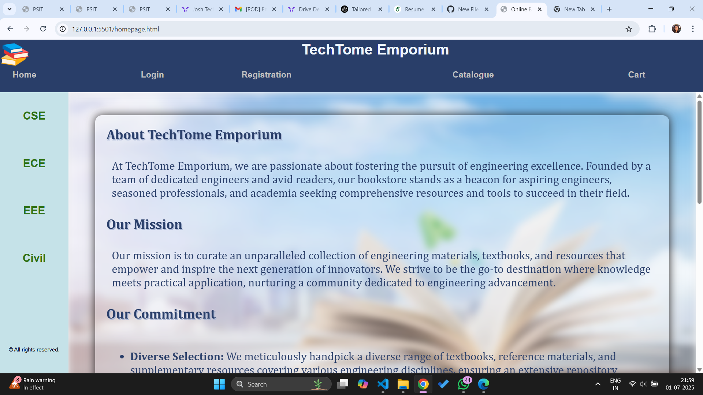
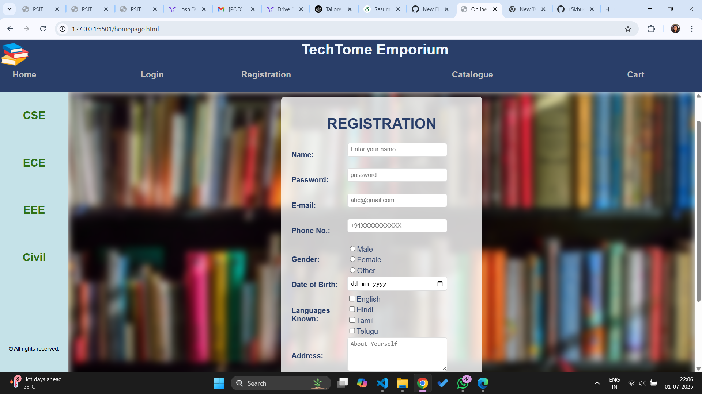
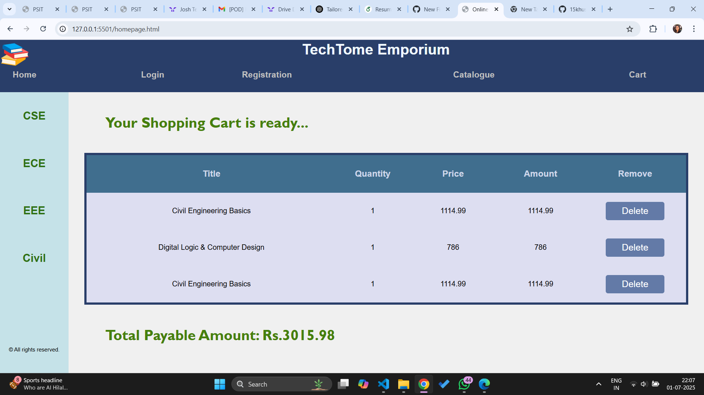

# 📚 Book Store Website

An interactive and responsive web-based Book Store that allows users to browse, register, log in, add books to their cart, and generate a bill on checkout. The platform features user-friendly design, form validation, and a seamless shopping experience.

---

## 🚀 Features

- User Registration and Login with form validation
- Browse and filter book collection department wise
- Add/remove books from the cart
- Real-time cart updates and bill generation
- Responsive across devices

---

## 🛠️ Technologies Used

- **HTML5**
- **CSS3**
- **JavaScript**

---

## 🖼️ Screenshots

### 🏠 Homepage

### 🔐 Login Page

### 📝 Registration Page

### 📚 Books Catalogue

### 🛒 Cart Page

---

## 📂 Project Structure
book-store-website/
├── index.html
├── login.html
├── register.html
├── catalogue.html
├── cart.html
├── css/
│ └── style.css
├── js/
│ └── script.js
├── screenshots/
│ ├── homepage.png
│ ├── login.png
│ ├── register.png
│ ├── catalogue.png
│ └── cart.png
└── README.md

---

## ⚙️ How to Run the Project

1. Clone the repository:
   git clone https://github.com/yourusername/book-store-website.git

2. Navigate to the project directory:
   cd book-store-website
   
4. Open index.html in your browser to start exploring.

👩‍💻 Author
Khushi Rastogi
📧 khushijuly15@gmail.com

   

